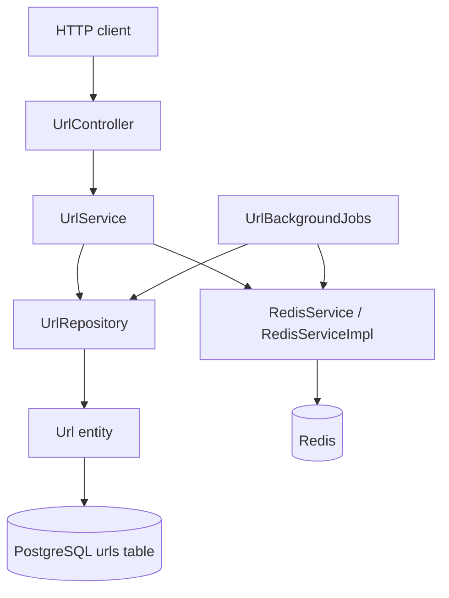
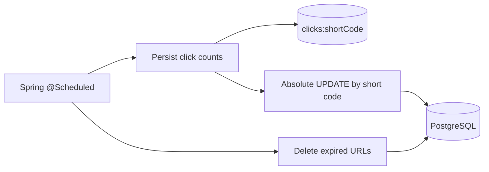

# Architecture Diagrams

## Component Diagram



## Redirect Decision Diagram

```mermaid
flowchart TD
    Start[GET /{shortCode}] --> Cache{Redis URL present?}
    Cache -->|yes| CacheExpiry{Cached expiry passed?}
    CacheExpiry -->|yes| Invalidate[Invalidate URL key]
    Invalidate --> Expired404[404 URL_EXPIRED]
    CacheExpiry -->|no| CountHit[Increment Redis clicks]
    CountHit --> Redirect[302 Location: longUrl]
    Cache -->|no or Redis failure| DB{PostgreSQL row present?}
    DB -->|no| Missing404[404 URL_NOT_FOUND]
    DB -->|yes| DBExpiry{Database expiry passed?}
    DBExpiry -->|yes| ExpiredDB404[404 URL_EXPIRED]
    DBExpiry -->|no| Populate[Cache URL with TTL]
    Populate --> CountMiss[Increment Redis clicks]
    CountMiss --> Redirect
```

## Scheduled Work


