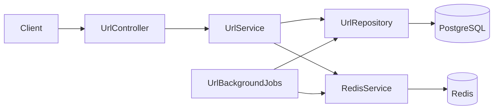

# High-Level Design

## System Overview

The implementation is one Spring Boot application. `UrlController` exposes HTTP endpoints, `UrlService` owns URL and redirect behavior, `UrlRepository` persists `Url` entities in PostgreSQL, and `RedisServiceImpl` uses Redis for hot URL data and click counters. `UrlBackgroundJobs` contains two scheduled jobs.

There is no load balancer, gateway, queue, separate worker process, authentication layer, or microservice boundary in the code.

## Traffic Assumptions

The assignment planning assumption is 1,000,000 new URLs per day and a 100:1 read-to-write ratio. These values are used for capacity planning only; this project contains no benchmark proving throughput or latency.

## High-Level Architecture

## Component Responsibilities

| Component | Actual responsibility |
| --- | --- |
| `UrlController` | Maps four REST operations to service calls and creates `201`, `302`, and `204` responses. |
| `UrlService` | Validates service-level input, generates codes, handles aliases, redirect lookup, expiry checks, statistics, deletion, cache writes, and best-effort Redis failure fallback. |
| `UrlRepository` | Spring Data JPA access for lookup, uniqueness checks, expiry selection, deletion, and absolute click updates. |
| `Url` | JPA entity for URL metadata and persisted clicks. |
| `RedisServiceImpl` | Serializes `CachedUrl`, stores URL values with TTL, increments/read counters, initializes counters, and deletes both keys. |
| `UrlBackgroundJobs` | Scheduled absolute click-count persistence and expired-row cleanup. |
| `GlobalExceptionHandler` | Converts validation, not-found, expiry, conflict, and unexpected failures to `ErrorResponse`. |

## PostgreSQL Role

PostgreSQL is the source of truth for `short_code`, destination, creation time, expiry, and the last persisted click count. The unique `short_code` constraint handles concurrent alias and generated-code collisions. An index on `expires_at` supports cleanup. JPA owns the development schema through `ddl-auto=update` by default.

## Redis Role

Redis has two independent string key families:

- `url:{shortCode}` contains JSON for `CachedUrl(longUrl, expiresAt)` and has a configured TTL, shortened to the remaining URL lifetime when applicable.
- `clicks:{shortCode}` contains an integer counter. It is incremented on redirects and has no TTL set by this implementation.

Redis failures are swallowed at the service boundary. Redirects fall back to PostgreSQL, and click updates remain best effort.

## Request Flows

- Create: validate, choose a custom alias or generate a seven-character SecureRandom Base62 code, insert PostgreSQL, initialize the Redis counter to zero.
- Redirect: read Redis first; reject an expired cached value; on a miss read PostgreSQL, reject an expired row, cache it, increment the counter, and return the destination.
- Statistics: read metadata from PostgreSQL and prefer the Redis counter; if absent, use the persisted value and initialize Redis.
- Delete: find and delete the PostgreSQL row, then delete both Redis keys best effort.

## Caching Strategy

This is a read-through cache for redirects. A cache hit avoids PostgreSQL lookup. A cache miss loads from PostgreSQL and populates Redis. Cache entries use the configured one-hour TTL by default, or the time remaining to `expiresAt`. There is no cache warming, eviction policy configuration, distributed invalidation, or negative cache.

## Click-Counting Architecture

Each successful redirect increments `clicks:{shortCode}` in Redis. The redirect does not synchronously update PostgreSQL. Every scheduled click job scans `findAll()`, reads each Redis counter, and calls `updateClicksByShortCode` with the absolute value. Repeating a run is idempotent; a deleted row updates zero rows. Statistics prefer the live Redis value, so they may be ahead of PostgreSQL.

## Expiry Architecture

Creation rejects an expiry that is not in the future. Redirects check expiry on both cache hits and PostgreSQL misses. Expired cached entries are invalidated and return `404`; expired database rows return `404`. A scheduled cleanup queries `findByExpiresAtBefore(Instant.now())` and deletes selected rows. Statistics do not independently check expiry, so an expired row may be returned by statistics until cleanup removes it.

## Scalability Considerations

The Redis-first redirect path reduces PostgreSQL reads for cached codes. The Hikari pool is bounded, and Hibernate batching/order settings are configured. The scheduled click job currently scans every URL, so very large datasets would need a different persistence strategy. A single application instance also means scheduled work and capacity scale with deployment choices that are not implemented here.

## Failure Handling

- Redis read/write failures fall back to PostgreSQL or are ignored where the operation is an optimization.
- Generated inserts retry up to ten times after an existence check or database integrity failure.
- Custom alias integrity failures become `409 Conflict`.
- Background failures are caught globally and per record, then retried by the next fixed-delay run.
- Unexpected request failures become a generic `500` JSON response.

## Security Considerations

Destination URLs are restricted to HTTP/HTTPS and must have a host. Aliases are restricted to 3-64 characters matching `[A-Za-z0-9_-]`. JPA repository methods use parameters. The implementation has no authentication, authorization, rate limiting, abuse detection, or outbound destination fetch, and therefore does not claim to solve those concerns.
