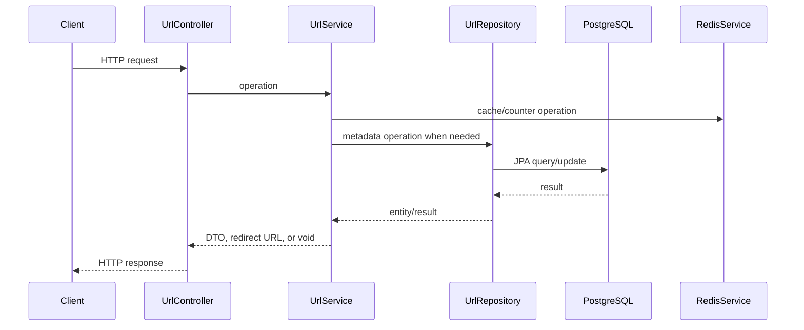

# Class Design

## Responsibilities

| Class / interface | Responsibility |
| --- | --- |
| `UrlController` | REST mapping and HTTP response status/location construction. |
| `UrlService` | Application rules for create, redirect, stats, delete, validation, code collision retries, expiry, and cache fallback. |
| `UrlBackgroundJobs` | Fixed-delay click persistence and expiry cleanup via `@Scheduled`. |
| `UrlRepository` | Spring Data JPA repository and custom query/update methods. |
| `Url` | Persistent URL aggregate fields and getters/setters. |
| `ShortCodeGenerator` | Seven-character `SecureRandom` Base62 generation. |
| `RedisService` | Cache/counter abstraction used by the service and scheduled jobs. |
| `RedisServiceImpl` | Redis string operations and Jackson serialization. |
| `CachedUrl` | Immutable cached destination/expiry record. |
| DTOs | JSON request/response shapes: `ShortenRequest`, `ShortenResponse`, `StatsResponse`, and `ErrorResponse`. |
| Exceptions/advice | Domain exceptions and centralized JSON error translation. |

## Controller to Service to Repository

## Patterns Actually Used

- Spring dependency injection and MVC controller/service/repository layering.
- Repository pattern through Spring Data `JpaRepository`.
- Read-through cache for redirect lookup.
- Cache-aside population on PostgreSQL redirect misses.
- Strategy-like interface boundary through `RedisService`, allowing the service tests to use an in-memory implementation.
- Scheduled background processing through Spring `@Scheduled`.
- Centralized exception translation through `@RestControllerAdvice`.
- Idempotent absolute click-count replacement rather than additive database updates.

There is no claim of a microservice, event-driven queue, CQRS, or distributed lock pattern.
