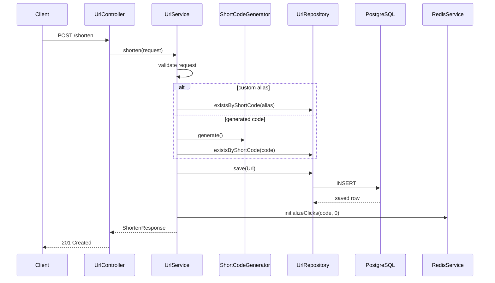
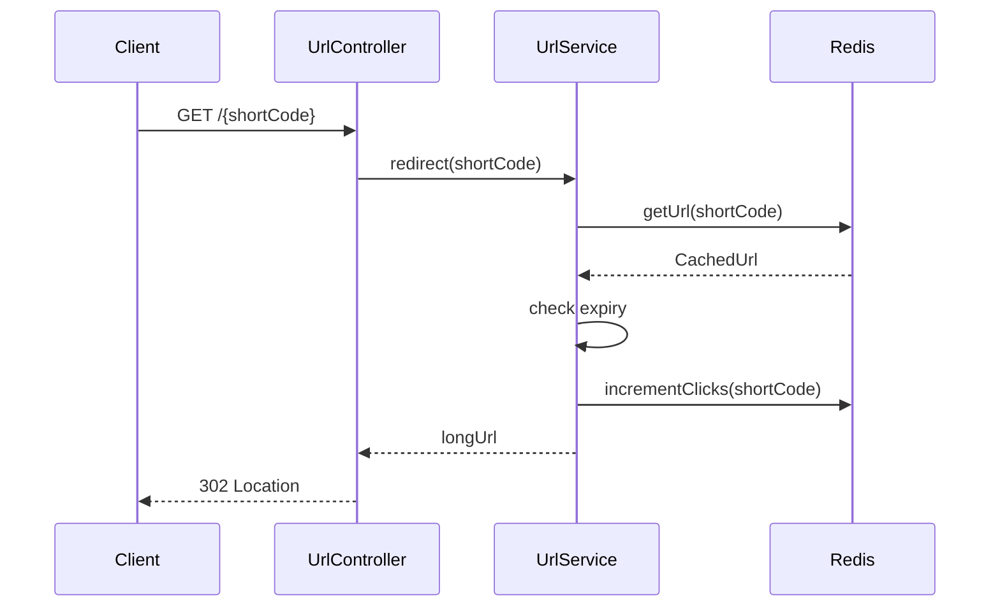
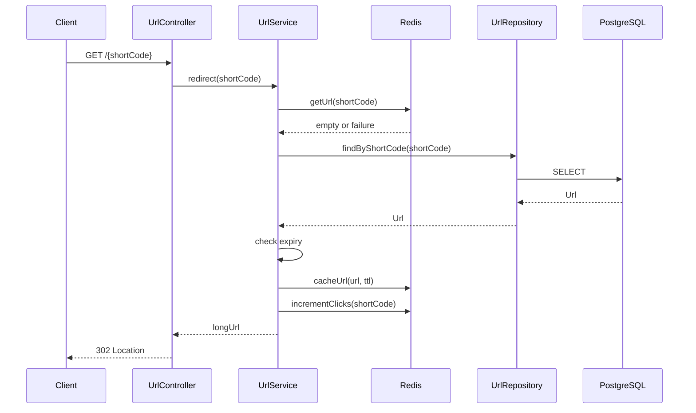
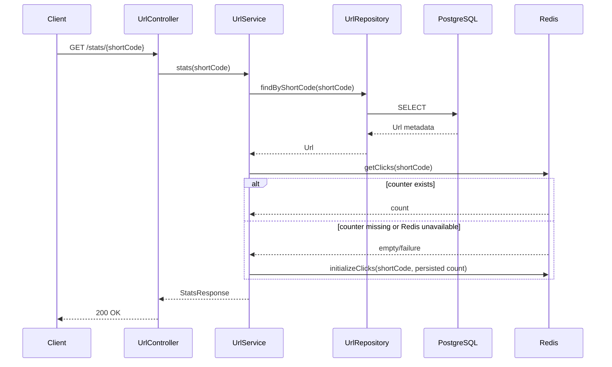
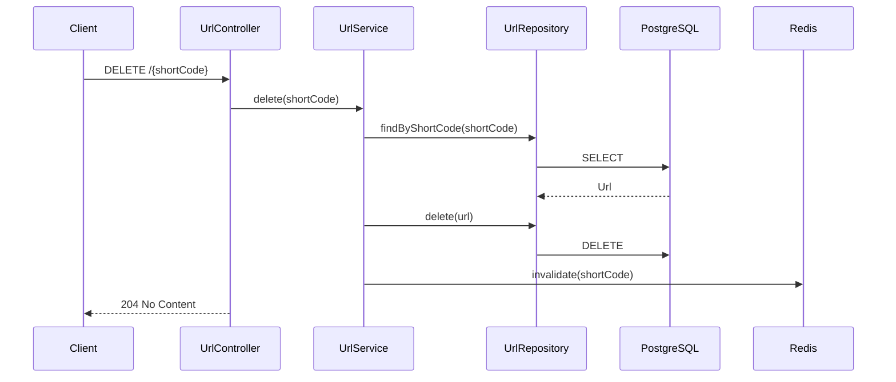
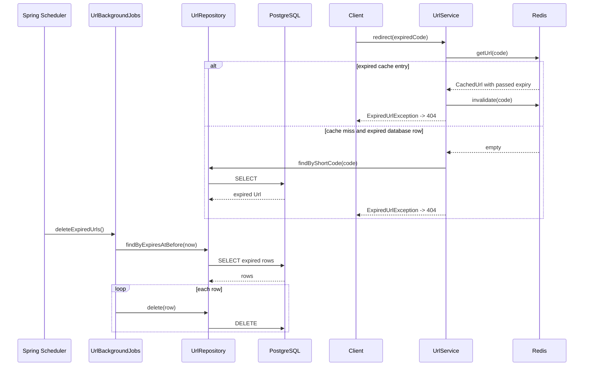

# Sequence Diagrams

## Create URL

```mermaid
sequenceDiagram
    participant C as Client
    participant Ctrl as UrlController
    participant S as UrlService
    participant G as ShortCodeGenerator
    participant R as UrlRepository
    participant P as PostgreSQL
    participant Redis as RedisService

    C->>Ctrl: POST /shorten
    Ctrl->>S: shorten(request)
    S->>S: validate request
    alt custom alias
        S->>R: existsByShortCode(alias)
    else generated code
        S->>G: generate()
        S->>R: existsByShortCode(code)
    end
    S->>R: save(Url)
    R->>P: INSERT
    P-->>R: saved row
    S->>Redis: initializeClicks(code, 0)
    S-->>Ctrl: ShortenResponse
    Ctrl-->>C: 201 Created
```

## Redirect with Redis Hit

```mermaid
sequenceDiagram
    participant C as Client
    participant Ctrl as UrlController
    participant S as UrlService
    participant Redis as Redis

    C->>Ctrl: GET /{shortCode}
    Ctrl->>S: redirect(shortCode)
    S->>Redis: getUrl(shortCode)
    Redis-->>S: CachedUrl
    S->>S: check expiry
    S->>Redis: incrementClicks(shortCode)
    S-->>Ctrl: longUrl
    Ctrl-->>C: 302 Location
```

## Redirect with Redis Miss

```mermaid
sequenceDiagram
    participant C as Client
    participant Ctrl as UrlController
    participant S as UrlService
    participant Redis as Redis
    participant R as UrlRepository
    participant P as PostgreSQL

    C->>Ctrl: GET /{shortCode}
    Ctrl->>S: redirect(shortCode)
    S->>Redis: getUrl(shortCode)
    Redis-->>S: empty or failure
    S->>R: findByShortCode(shortCode)
    R->>P: SELECT
    P-->>R: Url
    R-->>S: Url
    S->>S: check expiry
    S->>Redis: cacheUrl(url, ttl)
    S->>Redis: incrementClicks(shortCode)
    S-->>Ctrl: longUrl
    Ctrl-->>C: 302 Location
```

## Statistics

```mermaid
sequenceDiagram
    participant C as Client
    participant Ctrl as UrlController
    participant S as UrlService
    participant R as UrlRepository
    participant P as PostgreSQL
    participant Redis as Redis

    C->>Ctrl: GET /stats/{shortCode}
    Ctrl->>S: stats(shortCode)
    S->>R: findByShortCode(shortCode)
    R->>P: SELECT
    P-->>R: Url metadata
    R-->>S: Url
    S->>Redis: getClicks(shortCode)
    alt counter exists
        Redis-->>S: count
    else counter missing or Redis unavailable
        Redis-->>S: empty/failure
        S->>Redis: initializeClicks(shortCode, persisted count)
    end
    S-->>Ctrl: StatsResponse
    Ctrl-->>C: 200 OK
```

## Delete

```mermaid
sequenceDiagram
    participant C as Client
    participant Ctrl as UrlController
    participant S as UrlService
    participant R as UrlRepository
    participant P as PostgreSQL
    participant Redis as Redis

    C->>Ctrl: DELETE /{shortCode}
    Ctrl->>S: delete(shortCode)
    S->>R: findByShortCode(shortCode)
    R->>P: SELECT
    P-->>R: Url
    S->>R: delete(url)
    R->>P: DELETE
    S->>Redis: invalidate(shortCode)
    Ctrl-->>C: 204 No Content
```

## Expiry

```mermaid
sequenceDiagram
    participant Scheduler as Spring Scheduler
    participant Job as UrlBackgroundJobs
    participant R as UrlRepository
    participant P as PostgreSQL
    participant C as Client
    participant S as UrlService
    participant Redis as Redis

    C->>S: redirect(expiredCode)
    S->>Redis: getUrl(code)
    alt expired cache entry
        Redis-->>S: CachedUrl with passed expiry
        S->>Redis: invalidate(code)
        S-->>C: ExpiredUrlException -> 404
    else cache miss and expired database row
        Redis-->>S: empty
        S->>R: findByShortCode(code)
        R->>P: SELECT
        P-->>R: expired Url
        S-->>C: ExpiredUrlException -> 404
    end
    Scheduler->>Job: deleteExpiredUrls()
    Job->>R: findByExpiresAtBefore(now)
    R->>P: SELECT expired rows
    P-->>R: rows
    loop each row
        Job->>R: delete(row)
        R->>P: DELETE
    end
```
